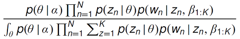
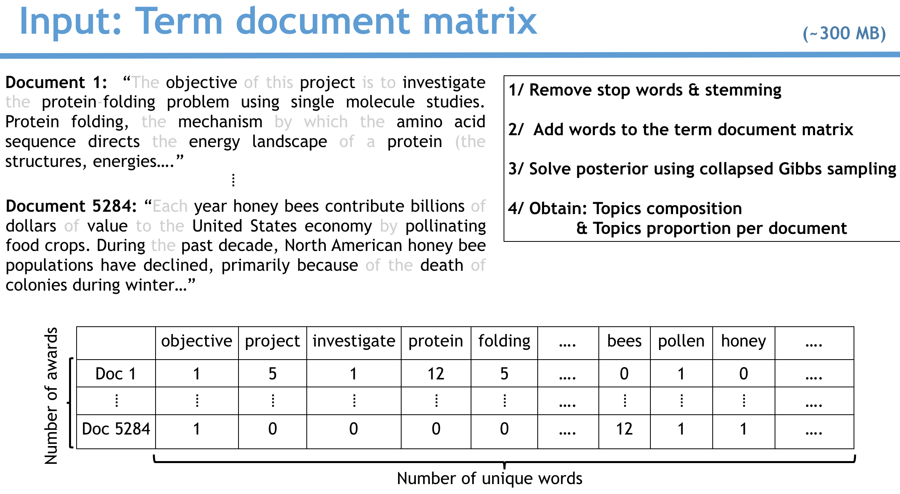
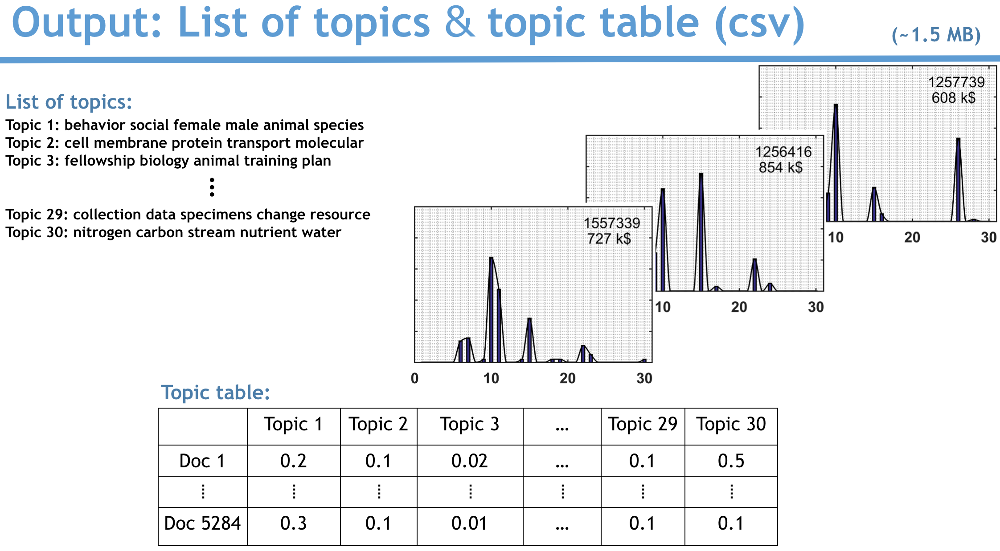

# Welcome to the ds4all github repo 

Welcome to the ds4all github repo. The easiest way to navigate it is on the associated dynamic website: [ds4all.io](http://54.234.234.146/). 

The repo is structured as follows:  
  ├── app  
  ├── nlq  
  ├── pipeline  
  ├── README.md

**[app] Contains the source of the web app, therefore you can:**  
git clone https://github.com/clemriedel/ds4all  
cd ds4all/app  
python app.py  
Open your browser and go to 0.0.0.0:8000 to run it locally.

**Natural Language Quantification** permits to find patterns and quantify an amount generated by the patterns. An example is the money generated by topics in the National Science Foundation grants. NLQ can be applied to any activity described by words and quantified by numbers.

**Latent Dirichlet Allocation** --it takes few seconds to run the command line ([lda package](https://pypi.python.org/pypi/lda)); and a lifetime to master the power and flexibility of the algorithm. Blei, Ng and Jordan *(Journal of Machine Learning Research 3 (2003) 993-1022)* wrote the expression of the posterior:

It might look daring; but thanks to the plate notation, it is really 
to understand. We solve it using Collapsed Gibbs sampling. 

It is important to understand what are the inputs and outputs of the algorithm.

***Input***

**Latent Dirichlet Allocation** --it takes few seconds to run the command line ([lda 

***Output***

